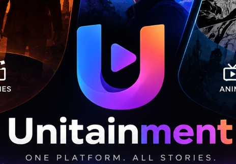

# Unitainment — One Platform. All Stories.

<div align="center">
  
  <p><strong>The Unified Entertainment Platform Combining IMDb, MyAnimeList & Steam Games</strong></p>
</div>

---

## 🌟 Overview

**Unitainment** is a unified all-in-one entertainment hub that brings together cinema, television, anime, manga, and video games into a single experience. Discover, filter, track watchlists/playlists, rate, and engage with community forums and live chat.

- 🎬 **Movies & Television (IMDb / OMDb)**: Live lookup and search across millions of movies and shows. View directors, leading cast, content rating (PG-13, R, TV-MA), Metascores, awards, and box office earnings.
- ⛩️ **Anime & Manga (MyAnimeList / Jikan)**: Browse top airing, seasonal series, and classics with episode counts, studio badges, Dub/Sub audio filters, and direct MAL integration.
- 🎮 **Video Games (Steam Web API)**: Real-time concurrent online player counts, average playtime ranges, store prices, deck compatibility, and developer tags.
- 📋 **Universal Library Tracking**: 1-click status tracking across *Plan to Watch/Play*, *Watching/Playing*, *Completed*, *On Hold*, and *Dropped*.
- 💬 **Community & Social**: 1–10 star score rating with reviews, topic-based forums, and a real-time live chat lounge.

---

## 🚀 Key Features

- **10 Results Per Page Pagination**: Clean, numbered pagination (`1`, `2`, `3`...) across all media hubs with smooth scrolling.
- **Resilient Edge Image Cache**: Global CDN proxy (`wsrv.nl`) with `referrerPolicy="no-referrer"` bypassing ISP connection resets (`ECONNRESET`) and hotlinking blocks.
- **Deep Entertainment Detail Pages**:
  - **Movies**: Director, cast, runtime, box office, awards, official trailers, verified IMDb link.
  - **TV Series & Anime**: Episode count, seasons count, episode runtime, audio dub/sub.
  - **Games**: Average playtime (e.g., `60 - 130 hrs`), live player counts, prices.
- **Flexible Filtering**: Substring genre matching and country alias recognition (e.g. USA / United States).
- **Modern UI**: Dark glassmorphic design with gradient accents, skeleton loaders, and responsive left navigation bar.

---

## 🛠️ Tech Stack

- **Framework**: Next.js 14 (App Router, Server & Client Components)
- **Language**: TypeScript
- **Styling**: Tailwind CSS, Lucide React Icons
- **Database & ORM**: SQLite with Prisma ORM
- **Authentication**: NextAuth.js (Google OAuth & Instant Demo Login)
- **APIs**: OMDb (IMDb), Jikan / MAL API, Steam Web API

---

## 📦 Getting Started

### 1. Clone the repository
```bash
git clone https://github.com/RenItsuki/Unitainment.git
cd Unitainment
```

### 2. Install dependencies
```bash
npm install
```

### 3. Setup Environment Variables
Copy `.env.example` to `.env`:
```bash
cp .env.example .env
```

Configure your API keys:
```env
# Database
DATABASE_URL="file:./dev.db"

# NextAuth
NEXTAUTH_URL="http://localhost:3000"
NEXTAUTH_SECRET="your-secret-key-32-chars-minimum"

# Movies & TV (IMDb via OMDb)
OMDB_API_KEY="your-omdb-api-key"

# Steam Web API
STEAM_API_KEY="your-steam-api-key"

# MyAnimeList Developer API
MAL_CLIENT_ID="your-mal-client-id"
MAL_CLIENT_SECRET="your-mal-client-secret"
```

### 4. Initialize Database
```bash
npx prisma db push
```

### 5. Run Development Server
```bash
npm run dev
```

Open [http://localhost:3000](http://localhost:3000) in your browser.

---

## 📜 License

This project is licensed under the MIT License.
